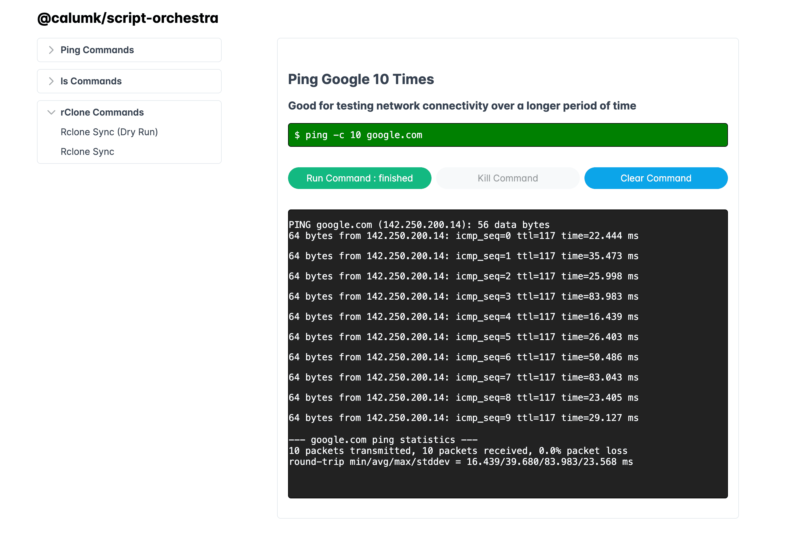

# @calumk/script-orchestra

A minimal application for running scripts remotely, and seeing the output.

> [!WARNING]
> Very much a beta - No auth yet, no versioning, no tests, no error handling, no logging, no security, no nothing.


> [!NOTE]
> Pull Requests welcome! :)




## To Run

Clone the repo.
```
$ git clone https://github.com/calumk/script-orchestra.git
```

Install the repo.
```
$ bun i
```

Edit the config file
```
code commands_data/commands.json
```


Run the repo.
```
$ bun index.js
```

## To Debug

You can rebuild the vite project, or run it in dev mode if you like, but you will need to change some port settings.
